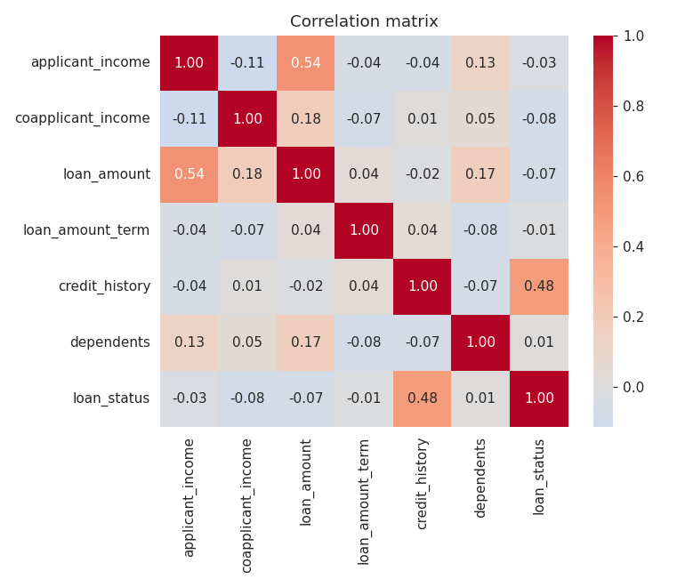
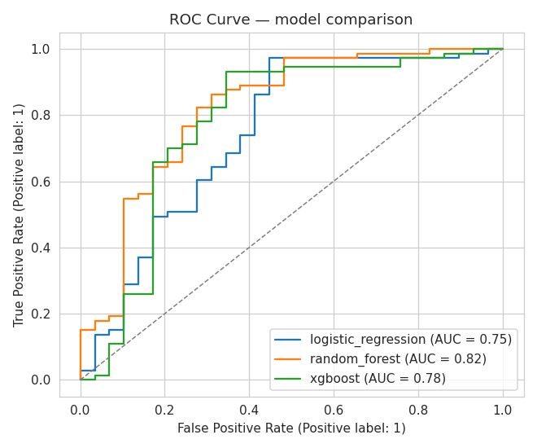
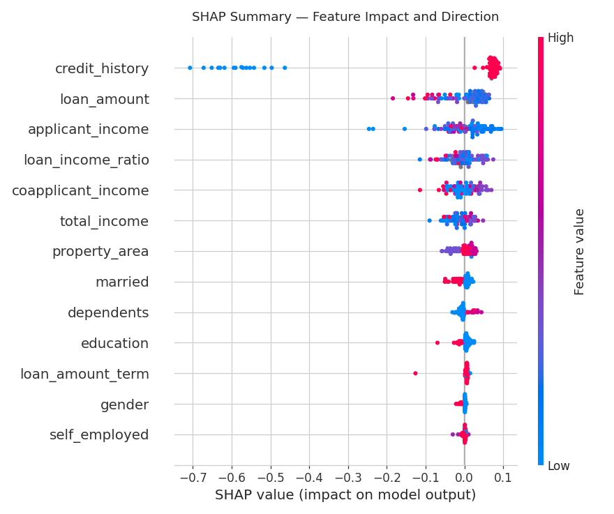
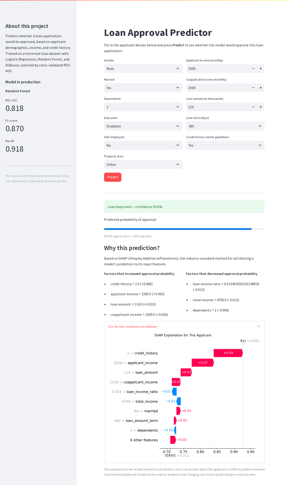

# Loan Approval Prediction

[](https://www.python.org/)
[](https://scikit-learn.org/)
[](LICENSE)

A machine learning pipeline that predicts whether a loan application will be approved, based on applicant demographics, income, and credit history. Includes exploratory analysis, a reproducible preprocessing and modeling pipeline, model comparison, SHAP-based explainability with a fairness check, and a Streamlit app for interactive predictions.

## Project Overview

Lenders process large volumes of loan applications and need consistent, fast, and defensible approval decisions. This project builds a supervised classification pipeline that learns from historical loan outcomes and predicts approval probability for new applicants, along with a lightweight web interface for testing the model interactively.

The emphasis throughout is on a workflow that would survive contact with a real team: reusable preprocessing code shared between notebooks and the app, leakage-safe cross-validation, and a model selection process driven by held-out metrics rather than a single accuracy number.

## Business Problem

Manual loan underwriting is slow and inconsistent across reviewers. A model that flags likely approvals and rejections early can:

- Reduce time-to-decision for straightforward applications
- Surface borderline cases that need closer manual review
- Provide a consistent, auditable baseline to compare human decisions against

Because rejecting a creditworthy applicant and approving a risky one carry different costs, the project optimizes for ROC AUC rather than raw accuracy, and reports precision/recall separately so that trade-off is visible rather than hidden behind one number.

## Dataset

`data/raw/loans_modified.csv` — 563 loan applications with the following fields:

| Column | Description |
|---|---|
| `loan_id` | Application identifier |
| `gender` | Applicant gender |
| `married` | Marital status |
| `dependents` | Number of dependents (`0`, `1`, `2`, `3+`) |
| `education` | Graduate / Not Graduate |
| `self_employed` | Self-employment status |
| `applicant_income` | Applicant's monthly income |
| `coapplicant_income` | Coapplicant's monthly income |
| `loan_amount` | Requested loan amount (thousands) |
| `loan_amount_term` | Loan term, in days |
| `credit_history` | Whether credit history meets guidelines (1 / 0) |
| `property_area` | Urban / Semiurban / Rural |
| `loan_status` | Target: 1 = approved, 0 = rejected |

The raw file has missing values scattered across almost every column, exact duplicate rows, and repeated `loan_id`s from what look like resubmitted applications — all of which are handled explicitly in `02_Data_Preprocessing.ipynb` rather than silently dropped.

## Workflow

1. **Exploratory Data Analysis** (`01_Exploratory_Data_Analysis.ipynb`) — data quality checks, missing value patterns, target distribution, and univariate/bivariate analysis to identify which features carry signal.
2. **Preprocessing** (`02_Data_Preprocessing.ipynb`) — deduplication, feature engineering (`total_income`, `loan_income_ratio`), and a stratified train/test split. Imputation, scaling, and encoding are deferred to a `ColumnTransformer` fit inside the modeling pipeline to avoid leakage.
3. **Modeling** (`03_Modeling.ipynb`) — two baselines (majority class, `credit_history`-only) to establish a floor, then Logistic Regression, Random Forest, and XGBoost, each tuned with cross-validated grid or randomized search and compared against those baselines on the held-out test set.
4. **Evaluation** (`04_Model_Evaluation.ipynb`) — confusion matrices, ROC and precision-recall curves, decision-threshold optimization, feature importance, SHAP-based global and per-applicant explanations, a fairness check, and explicit sections on this project's limitations, result stability, and the business trade-offs behind the modeling choices.
5. **Deployment demo** (`05_Streamlit_Demo.ipynb`, `app/app.py`) — sanity-checks the saved model against representative applicants, serves it through a Streamlit interface with a SHAP explanation alongside every prediction, and closes with what a production architecture would need beyond this demo.

## Technologies

- Python 3.10+
- pandas, NumPy
- scikit-learn (Pipeline, ColumnTransformer, GridSearchCV, RandomizedSearchCV)
- XGBoost
- SHAP
- matplotlib, seaborn
- Streamlit
- joblib

## Project Structure

```
loan-approval-prediction/
├── README.md
├── requirements.txt
├── .gitignore
├── LICENSE
├── data/
│   ├── raw/                  # original dataset, untouched
│   └── processed/            # cleaned train/test splits
├── notebooks/
│   ├── 01_Exploratory_Data_Analysis.ipynb
│   ├── 02_Data_Preprocessing.ipynb
│   ├── 03_Modeling.ipynb
│   ├── 04_Model_Evaluation.ipynb
│   └── 05_Streamlit_Demo.ipynb
├── src/
│   ├── preprocessing.py      # cleaning, feature engineering, ColumnTransformer
│   ├── train.py               # model specs, hyperparameter search, persistence
│   ├── evaluate.py            # metrics and plots
│   ├── explain.py             # SHAP global/local explanations, fairness checks
│   ├── predict.py             # single-record inference used by the app
│   └── utils.py                # shared paths, constants, example applicants, timer
├── models/                    # trained pipelines (.joblib)
├── outputs/
│   ├── figures/                # generated plots
│   └── reports/                # model_results.csv, baseline_comparison.csv
├── app/
│   └── app.py                  # Streamlit application
└── presentation/
    ├── presentation.tex        # Beamer slide source
    ├── presentation.pdf        # rendered slide deck
    └── slide-*.png              # per-slide PNGs for quick preview
```

A slide deck summarizing this project for a non-technical audience is in `presentation/` (PDF and per-slide PNGs).

## Results

Three models were tuned with 5-fold stratified cross-validation and compared on a held-out 20% test set:

| Model | Accuracy | Precision | Recall | F1 | ROC AUC |
|---|---|---|---|---|---|
| **Random Forest** | 0.804 | 0.827 | 0.918 | 0.870 | **0.818** |
| XGBoost | 0.814 | 0.865 | 0.877 | 0.871 | 0.776 |
| Logistic Regression | 0.833 | 0.826 | 0.973 | 0.893 | 0.746 |

Random Forest was selected as the production model based on test ROC AUC and is the one saved as `models/best_model.joblib` and used by the Streamlit app. Full numbers, including training and inference time, are in `outputs/reports/model_results.csv`.

Across every model, `credit_history` is by a wide margin the strongest predictor of approval — consistent with a ~0.50 correlation with the target seen during EDA and confirmed by the feature importance plot. Income and loan amount contribute a smaller, secondary signal once expressed as engineered ratios rather than raw values.

**Is the model actually learning more than one feature?** A majority-class baseline scores 71.6% accuracy with a ROC AUC of exactly 0.5 (no ranking skill at all), and a Logistic Regression using *only* `credit_history` already reaches 0.728 ROC AUC. Random Forest's 0.818 is a real, meaningful gain over that single-feature floor; the full-feature Logistic Regression, at 0.746, barely improves on it — evidence that the linear model isn't extracting much beyond the one dominant feature, while Random Forest is picking up genuine interaction effects. Full comparison in `outputs/reports/baseline_comparison.csv` and `03_Modeling.ipynb`.

**Threshold, not just the model, determines outcomes.** ROC AUC measures ranking quality across every possible cutoff; the 0.5 default used above is not the only reasonable choice. `04_Model_Evaluation.ipynb` sweeps thresholds from 0.3 to 0.7 and discusses the trade-off in lending terms: a higher threshold trades recall (fewer creditworthy applicants approved) for precision (fewer risky approvals), which is the right direction when a default costs more than one loan's worth of foregone interest.

## Model Explainability & Fairness

`src/explain.py` wraps SHAP (`TreeExplainer`) around the winning Random Forest pipeline, collapsing one-hot encoded columns back onto their original feature names so the output reads as `property_area`, not `categorical__property_area_Rural`.

- **Global**: a bar chart of mean absolute SHAP value and a beeswarm plot showing both magnitude and direction, generated in `04_Model_Evaluation.ipynb`. `credit_history` dominates — a positive credit history contributes roughly +0.07 to the predicted approval probability on average, a negative one drags it down by more than 0.5.
- **Local**: per-applicant waterfall plots and a plain-language "factors that increased / decreased approval probability" breakdown, for three representative profiles (strong, weak, borderline) and, live, for every prediction made in the Streamlit app.
- **SHAP vs. built-in feature importance**: both are computed for the same model and largely agree on ranking, but SHAP additionally gives direction, per-instance explanations, and values expressed in the same units as the model's output — impurity-based importance gives none of that.
- **Fairness check**: `gender` has the lowest mean |SHAP| of any feature in the model; `married` and `dependents` carry a small but non-zero effect. None dominates the way `credit_history` does, but a real deployment would still need a legal and compliance review before using a model that includes these fields — see the notebook for the full discussion of proxy discrimination and regulatory risk (e.g. ECOA in the US).

SHAP explains what the **model** learned from historical data, not a causal relationship — a large SHAP value is not evidence that changing that attribute would change a real applicant's outcome. This caveat, and the fairness discussion above, are spelled out in full in `04_Model_Evaluation.ipynb`, sections 11–12.

## Screenshots

| EDA | Model Comparison | Explainability | Streamlit App |
|---|---|---|---|
|  |  |  |  |

## How to Run

### Google Colab

Each notebook is self-contained. Open any notebook in Colab and run all cells top to bottom — the first cell clones this repository and installs dependencies automatically:

1. Open a notebook from `notebooks/` in Colab.
2. Run all cells (`Runtime > Run all`).
3. No manual setup required.

### Local Installation

```bash
git clone https://github.com/AnaNicuesa/loan-approval-prediction.git
cd loan-approval-prediction
python -m venv venv
source venv/bin/activate  # Windows: venv\Scripts\activate
pip install -r requirements.txt
```

Run the notebooks in order (01 through 05), or launch the app directly using the model already committed to `models/`:

```bash
streamlit run app/app.py
```

## Limitations

- **Small dataset**: 510 rows after cleaning, a 102-row test set — enough to demonstrate the pipeline, not enough to fully trust the precise ranking between models.
- **Public, Kaggle-style dataset**: reflects one lender's historical decisions in an unspecified market and period, not a general claim about lending.
- **Few features**: no credit score, debt, or employment history — the kind of information a real underwriting model would have.
- **No temporal validation**: the train/test split is random, not time-based, so it can't detect performance drift over time the way a real deployment would need to.
- **No production monitoring**: this repository stops at a demo app; see `05_Streamlit_Demo.ipynb` for what a production deployment (API, logging, drift monitoring) would require instead.

Full discussion, including possible selection bias and result stability given the small test set, is in `04_Model_Evaluation.ipynb`.

## Future Improvements

- Run a formal fairness audit (e.g. demographic parity, equal opportunity across `gender` and `married`) rather than relying on SHAP magnitude alone as a proxy for fairness.
- Expand hyperparameter search budgets (larger `n_iter`, nested CV) once more compute is available.
- Collect a larger, more recent dataset — 563 rows is enough to demonstrate the pipeline but too small to fully trust the generalization of the tuned hyperparameters.
- Add monitoring for data drift and for SHAP attribution drift if this were ever connected to a live application stream.

## Author

**Ana Nicuesa**
Data Scientist / ML Engineer
ananicuesa@gmail.com

## License

This project is licensed under the MIT License — see [LICENSE](LICENSE) for details.
